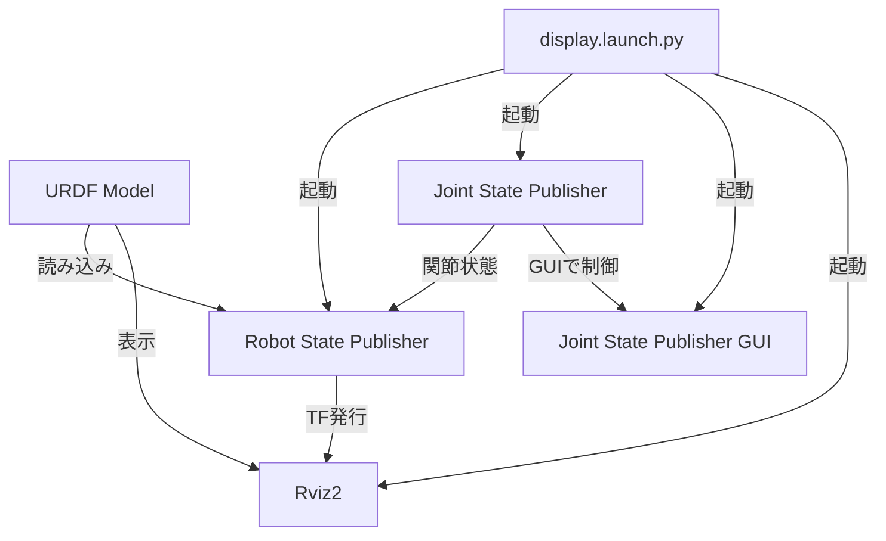
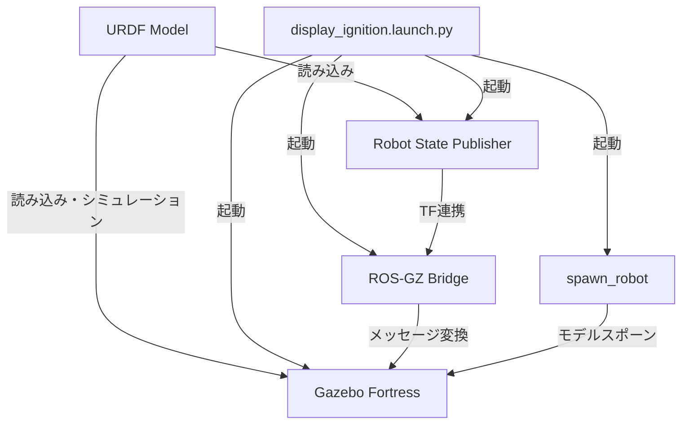
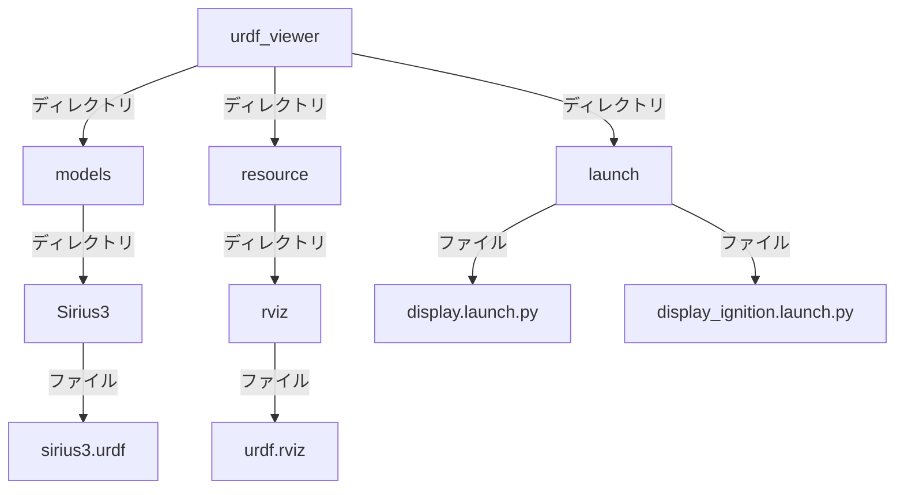

# URDF Viewer

URDFビューアーは、ROS 2環境でURDF（Unified Robot Description Format）モデルを簡単に表示・確認するためのパッケージです。

## 機能

- URDFモデルをRviz2で視覚化
- Joint State Publisherによる関節制御
- GUIによるインタラクティブな関節操作
- Gazebo FortressでのURDFモデル表示（新機能）

## システム構成

URDFビューアーは2つの主要なランチファイルを提供し、それぞれ異なる環境でロボットモデルを表示します。

### Rviz2表示システム（display.launch.py）

以下はRviz2を使用したURDFビューアーのシステム構成図です：



### Gazebo Fortress表示システム（display_ignition.launch.py）

以下はGazebo Fortressを使用したURDFビューアーのシステム構成図です：



## 起動ノードの説明

URDFビューアーでは各ランチファイルで以下の主要なノードが起動されます：

### 共通ノード

#### 1. robot_state_publisher
- **役割**: URDFモデルを読み込み、ロボットの関節状態から変換行列（transforms）を計算し、tfツリーとして公開
- **入力**: URDFモデル（`model`パラメータで指定）とjoint_states
- **出力**: tf/tf2メッセージ
- **パラメータ**: 
  - `robot_description`: URDFファイルの内容

### Rviz2表示システム固有のノード（display.launch.py）

#### 2. joint_state_publisher
- **役割**: URDFで定義された関節の状態（角度や位置）を管理・公開
- **条件**: GUIが無効の場合に起動（`gui=false`）
- **出力**: sensor_msgs/JointState型のjoint_statesメッセージ

#### 3. joint_state_publisher_gui
- **役割**: 関節状態の管理・公開とGUIインターフェースによる対話的操作
- **条件**: GUIが有効の場合に起動（`gui=true`、デフォルト）
- **特徴**: スライダーなどのUIで関節を操作可能
- **出力**: sensor_msgs/JointState型のjoint_statesメッセージ

#### 4. rviz2
- **役割**: ロボットモデルやセンサーデータなどを3D視覚化
- **設定**: urdf_config.rvizファイルを使用
- **入力**: tfデータ、URDFモデル情報

### Gazebo Fortress表示システム固有のノード（display_ignition.launch.py）

#### 5. Gazebo Fortress（gz_sim）
- **役割**: 物理シミュレーション環境でURDFモデルを表示・シミュレーション
- **設定**: empty.sdfワールドを使用
- **入力**: URDFモデル、ros-gzブリッジからのデータ

#### 6. ros_gz_bridge
- **役割**: ROS 2とGazebo Ignition間でメッセージを変換
- **変換対象**:
  - クロック（/clock）
  - ポーズ（/model/Sirius3/pose）
  - TF（/model/Sirius3/tf）

#### 7. spawn_robot（ros_gz_sim create）
- **役割**: URDFモデルをGazebo Fortressの世界にスポーン
- **設定**: モデル名、位置（x, y, z）を指定
- **入力**: URDFモデルファイル

## TF（Transform）ツリー

URDFモデルから生成されるTFツリーは、ロボットの各リンク間の位置関係を表します。以下は一例です：

```
base_link
├── link1
│   └── link2
│       └── link3
└── link4
    └── link5
```

TFを確認するには以下のコマンドを使用できます：

```bash
# URDFビューアーを起動した状態で実行してください
# TFツリーを表示（ROS 2 Humble用）
ros2 run tf2_tools view_frames

# 特定のTF関係を確認
ros2 run tf2_ros tf2_echo [source_frame] [target_frame]

# TFデータを確認
ros2 topic echo /tf
```

実行後に生成される`frames.pdf`ファイルでTFツリーの全体構造を確認できます。

**注意**: TFコマンドを実行するには、事前にURDFビューアーを起動してtfデータが配信されている必要があります。

## 使用方法

### インストール

```bash
cd ~/ros2_ws
colcon build --packages-select urdf_viewer
source install/setup.bash
```

### URDFモデルの表示（Rviz2）

基本的な起動コマンド:

```bash
ros2 launch urdf_viewer display.launch.py
```

異なるURDFモデルを表示する場合:

```bash
ros2 launch urdf_viewer display.launch.py model:=/path/to/your/model.urdf
```

GUIなしで起動する場合:

```bash
ros2 launch urdf_viewer display.launch.py gui:=false
```

### URDFモデルの表示（Gazebo Fortress - 新機能）

Gazebo Fortressでモデルを表示する基本コマンド:

```bash
ros2 launch urdf_viewer display_ignition.launch.py
```

異なるURDFモデルを表示する場合:

```bash
ros2 launch urdf_viewer display_ignition.launch.py model:=/path/to/your/model.urdf
```

## Gazebo Fortressでの表示について（新機能）

Gazebo Fortressは新しいGazeboアーキテクチャに基づく物理エンジンで、以下の特徴があります：

- 高性能・軽量な物理シミュレーション
- モダンなレンダリングエンジン
- ROS 2との統合が容易
- 分散シミュレーション対応

### 必要なパッケージ

Gazebo Fortressでの表示には以下のパッケージが必要です：

```bash
# インストールコマンド
sudo apt install -y ros-humble-ros-gz
```

### システム構成

Gazebo Fortressでの表示時の主要コンポーネント：

1. **robot_state_publisher**: URDFモデル情報とTFツリーを提供
2. **ros_gz_bridge**: ROS 2とGazebo Ignition間でのメッセージ変換
3. **ros_gz_sim**: シミュレーション環境の提供とモデルのスポーン

### 技術的制限

- 従来のGazeboタグとIgnitionガゼボのタグが一部異なります
- 複雑な形状や特定のプラグインは互換性がない場合があります
- 初回起動時は処理に時間がかかることがあります

## パッケージ構成

- `launch/`: 起動ファイル
  - `display.launch.py`: Rviz2での表示用ランチファイル
  - `display_ignition.launch.py`: Gazebo Fortress表示用ランチファイル（新規追加）
- `models/`: URDFモデルファイル
  - `Sirius3/`: Sirius3ロボットのURDFモデル
- `resource/rviz/`: Rvizの設定ファイル

## ディレクトリ構造



## 依存パッケージ

- rclpy
- xacro
- urdf
- joint_state_publisher
- joint_state_publisher_gui
- robot_state_publisher
- rviz2
- launch_ros
- ros_gz_bridge (Gazebo Fortress用)
- ros_gz_sim (Gazebo Fortress用)